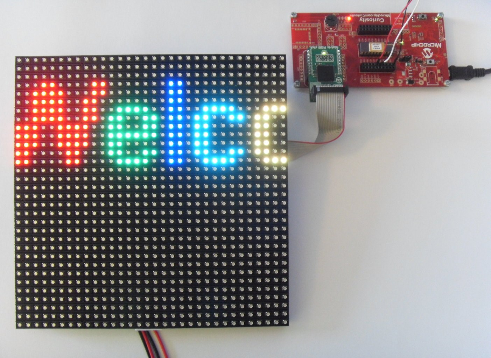

  <article class="markdown-body entry-content p-3 p-md-6" itemprop="text">

# PIC16F18446 Matrix RGB

## Objective:
Using the PIC16F18446 to control the 32x32 RGB LED matrix via the Matrix RGB Click board. A text message scrolls on the RGB display.

## Demo Configuration:
The default text is "Welcome to Microchip !". The text message can be updated via UART, by simply sending a new string, ending in '\n'. The PIC's EUSART is configured to use the 9600 baud rate, but that can easily be changed from MCC settings.

The MCU uses the high frequency internal oscilator (HFINTOSC), and the clock is set to 32 MHz. Watchdog Timer is not used in this demo, so it is disabled.

MCC configurations - System Module (Internal Oscillator and WWDT)

* Oscillator Select: HFINTOSC
* HF Internal Clock: 32_MHz
* Clock Divider: 1
* Watchdog Timer Enable: WDT Disabled, SWDTEN is ignored

MSSP1 is used for communicating with the Matrix RGB Click board. It is set to SPI Master, with input data sampled at middle, SPI Mode 0, and 8 MHz clock.

MCC configurations - MSSP1 Settings

* Mode: SPI Master
* Enable MSSP: checked
* Input Data Sampled at: Middle
* Clock Polarity: Idle:Low, Active:High
* Clock Edge: Active to Idle
* Clock Source: FOSC/4

EUSART1 is used to receive the input text string that is to be displayed on the RGB Matrix. It is set to asynchronous mode (UART), with 9600 baud rate, and a software receive buffer of 64 Bytes.

MCC configurations - EUSART1 Settings

* Mode: Asynchronous
* Enable EUSART: checked
* Baud Rate: 9600
* Enable Transmit: checked
* Transmission Bits: 8-bit
* Reception Bits: 8-bit
* Data Polarity: Non-Inverted
* Enable Receive: checked
* Enable EUSART Interrupts: checked
* Software Transmit Buffer Size: 8
* Software Receive Buffer Size: 64

MCC configurations - Pin Manager Settings

The pins are configured as follows:

* EUSART1 RX is connected to RC0
* EUSART1 TX is connected to RC1
* MSSP1 SCK is connected to RB6
* MSSP1 SDI is connected to RB4
* MSSP1 SDO is connected to RC7
* Matrix RGB RDY is connected to GPIO input RA2
* Matrix RGB RST is connected to GPIO output RA4
* Matrix RGB SLP is connected to GPIO output RC5
* Matrix RGB CS is connected to GPIO output RC6

The prototype demo is presented in the picture below.

## Demo Usage:

1. Plug the PIC16F18446 MCU into its socket on the Curiosity board
2. Plug the Matrix RGB click into the mikroBUS slot of the Curiosity board
3. Connect the 32x32 RGB Matrix INPUT to the Matrix RGB Click using the gray ribbon cable (red wire to the triangle mark)
4. Connect the power cable to its connector on the back of the RGB Matrix
5. After making the above hardware connections power the RGB Matrix using the 5V/3A DC adapter, and the Curiosity board using the USB cable.
6. Build demo firmware and load the generated hex file onto the PIC16F18446 MCU. When the demo firmware is loaded, the "Welcome to Microchip !" text starts scrolling on the RGB Matrix.
7. The text string can be changed via UART. For this, an USB to UART adapter can be used. Its GND must be connected to the GND on Curiosity, and its TX must be connected to the RX (pin RC0) on Curiosity. Then a terminal program can be used for entering the text. The sent text must end with the LF ('\n') character.

## Required Tools:

Hardware tools:

* PIC16F18446 (20-pin, PDIP) MCU
* The Curiosity development board
* 32x32 RGB Matrix display
* The Matrix RGB click board from MikroElektronika™

Software tools:

* MPLAB® X IDE v5.30
* MPLAB® Code Configurator (Plugin) v3.95
* XC8® Compiler v2.10
* Microcontrollers and peripherals Library v1.79

## Conclusion:

This example shows how easy it is to use the PIC16F18446 and MCC to control the 32x32 RGB Matrix and display a scrolling text.
